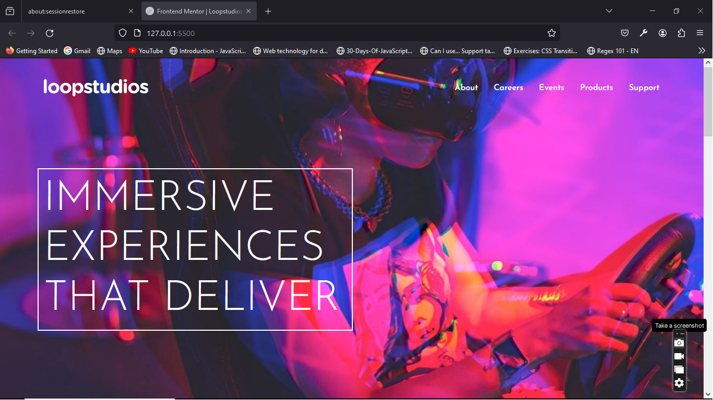

# Frontend Mentor - Loopstudios landing page solution

This is a solution to the [Loopstudios landing page challenge on Frontend Mentor](https://www.frontendmentor.io/challenges/loopstudios-landing-page-N88J5Onjw). Frontend Mentor challenges help you improve your coding skills by building realistic projects. 

## Table of contents

- [Overview](#overview)
  - [The challenge](#the-challenge)
  - [Screenshot](#screenshot)
  - [Links](#links)
- [My process](#my-process)
  - [Built with](#built-with)
  - [What I learned](#what-i-learned)
  - [Continued development](#continued-development)
  - [Useful resources](#useful-resources)
- [Author](#author)
- [Acknowledgments](#acknowledgments)


## Overview

### The challenge

Users should be able to:

- View the optimal layout for the site depending on their device's screen size
- See hover states for all interactive elements on the page

### Screenshot




### Links

- Solution URL: [Add solution URL here](https://your-solution-url.com)
- Live Site URL: [Add live site URL here](https://your-live-site-url.com)

## My process

### Built with

- Semantic HTML5 markup
- CSS custom properties
- Flexbox
- CSS Grid
- Mobile-first workflow


### What I learned

I was able to practice using display grid. It was an exciting challenge because I now understand how to use display grid, figure amd the picture elements. They are very essential in this project for a proper semantic HTML.

See below:

```html
        <figure>
          <picture>
            <source srcset="./images/desktop/image-deep-earth.jpg" media="(min-width: 768px)">
            
          </picture>
          <figcaption>Deep earth</figcaption>
        </figure>
```


### Continued development

I would like to continue working on much harder projects, I belive I can improve my skills that way.


## Author

- Website - [Nwobodo Igwe](https://igwe.vercel.app)
- Frontend Mentor - [@Igwe0001](https://www.frontendmentor.io/profile/yourusername)
- Twitter - [@Nwobodo_Igwe](https://www.twitter.com/yourusername)


## Acknowledgments

I would like to thank Front-end mentor for providing me with another opportunity to practice web development. More projects to come.

